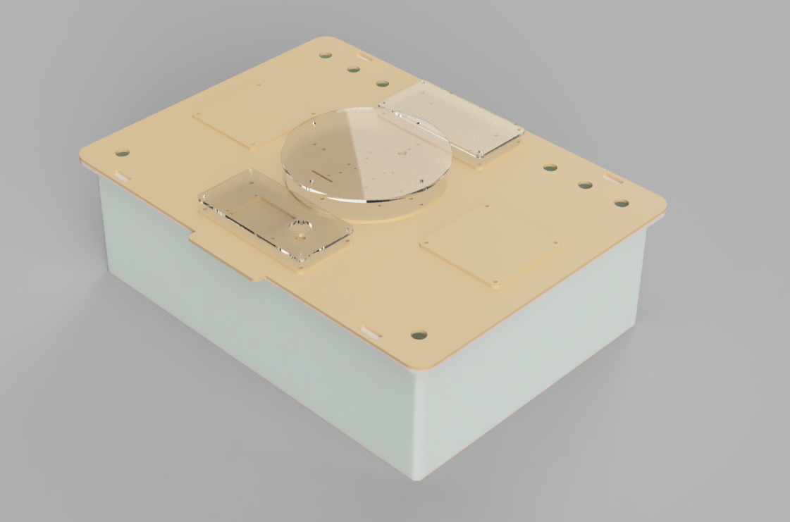

# WiggleR - Build

The following are steps to build WiggleR V0.1.0. WiggleR is a desktop research unit for making controlled experiments with worms.

## Bill of materials for box

### Materials
- [EuroBin 400*300](https://www.engelslogistiek.nl/webshop/stapelbare-opslag-en-transportbakken/e-line-euronorm-stapelbakken/EN-4312-1-1.html)
- Wood or acrylic
- Oil
- [M2.5 spacer kit](https://www.tinytronics.nl/shop/en/tools-and-mounting/installation-and-mounting-material/spacers/m2.5-spacer-kit)
- [M3 spacer kit](https://www.tinytronics.nl/shop/en/tools-and-mounting/installation-and-mounting-material/spacers/m3-spacer-kit)
- [Nuts and bolts](https://www.tinytronics.nl/shop/en/tools-and-mounting/installation-and-mounting-material/bolts/bolt-nut-and-washer-set-m2-m3-m4-including-3-allen-keys-1080-pieces)
- [Cable glands](https://www.tinytronics.nl/shop/en/tools-and-mounting/installation-and-mounting-material/cable-glands/cable-gland-m12-3mm-6.5mm)

### Tools
- Laser cutter
- 3D printer (optional)

### Build

Vector file for lasercutting can be found in the [`Design`](./Design/) folder.

WiggleR comprises a EuroBin for housing soil and worms, topped with a wooden lid to accommodate electronics like the Raspberry Pi.

For increased longevity, you can oil the birch wood with substances such as boiled linseed oil or Danish oil. Apply the oil using a (paper) cloth, ensuring to observe safety instructions, as oils can pose a fire hazard.

## Electronics

### Must have electronics

- Raspberry Pi or [Raspberry Zero](https://www.kiwi-electronics.com/nl/raspberry-pi-zero-wh-header-voorgesoldeerd-3328)
- [Raspberry HQ Camera](https://www.kiwi-electronics.com/nl/raspberry-pi-hq-camera-m12-mount-11243)
- [Raspberry Zero Adapters](https://www.kiwi-electronics.com/nl/raspberry-pi-zero-adapter-pack-2844)
- [Raspberry Zero Camera Adapter](https://www.kiwi-electronics.com/nl/raspberry-pi-zero-camera-adapter-2842)
- [Lens](https://www.kiwi-electronics.com/nl/m12-high-resolution-lens-12mp-113-fov-2-7mm-focal-length-11266)
- [Led Ring](https://www.tinytronics.nl/shop/nl/verlichting/ringen-en-modules/sk6812-digitale-5050-rgb-led-ring-24-leds-wit)

### Optional electronics

- [ADS1115](https://www.tinytronics.nl/shop/nl/sensoren/stroom-spanning/ads1115-16-bit-adc-i2c-module-4-kanaals)
- [Capacitive Soil Moisture sensor](https://www.tinytronics.nl/shop/en/sensors/liquid/capacitive-soil-moisture-sensor-module-with-cable). Make sure to buy a [good one](https://www.youtube.com/watch?v=IGP38bz-K48).
- [1MΩ resistor](https://www.tinytronics.nl/shop/en/components/resistors/resistors/1m%CF%89-resistor)
- [DS18B20 TO-92 Thermometer](https://www.tinytronics.nl/shop/en/sensors/temperature/ds18b20-to-92-thermometer-temperature-sensor-with-cable-waterproof-high-temperature-1m) (soil temperature)
- [DS18B20 Adapter](https://www.tinytronics.nl/shop/en/sensors/temperature/ds18b20-adapter) or 4.7kΩ resistor
- [BME680](https://www.tinytronics.nl/shop/nl/sensoren/lucht/druk/bme680-sensor-module-met-level-converter-luchtdruk-luchtkwaliteit-luchtvochtigheid-temperatuur)

### Tools
- Screw driver

### Connections

#### BME680

[Installation instuctions](https://raspberry-valley.azurewebsites.net/BME680-Sensor/)

| [RP Zero]((https://pinout.xyz/pinout/io_pi_zero)) | Sensor
--- | --- | 
| Pin 2 - 5v Power | VCC
| Pin 6 - Ground | GND
| Pin 3 - GPIO 2 | SDA
| Pin 5 - GPIO 3 | SCL

#### DS18B20

[Installation instuctions](https://www.circuitbasics.com/raspberry-pi-ds18b20-temperature-sensor-tutorial/)

| [RP Zero]((https://pinout.xyz/pinout/io_pi_zero)) | Sensor
--- | --- | 
| Pin 2 - 5v Power | VCC
| Pin 6 - Ground | GND
| Pin 7 - GPIO 4 | DAT

#### Soil Moisture Sensor

| [RP Zero]((https://pinout.xyz/pinout/io_pi_zero)) | ADS1115
--- | --- | 
| Pin 2 - 5v Power | VCC
| Pin 6 - Ground | GND
| Pin 3 - GPIO 2 | SDA
| Pin 5 - GPIO 3 | SCL

| Soil Moisture sensor | ADS1115
--- | --- | 
| AOUT | A0

[Installation instuctions](https://learn.adafruit.com/adafruit-4-channel-adc-breakouts/python-circuitpython)