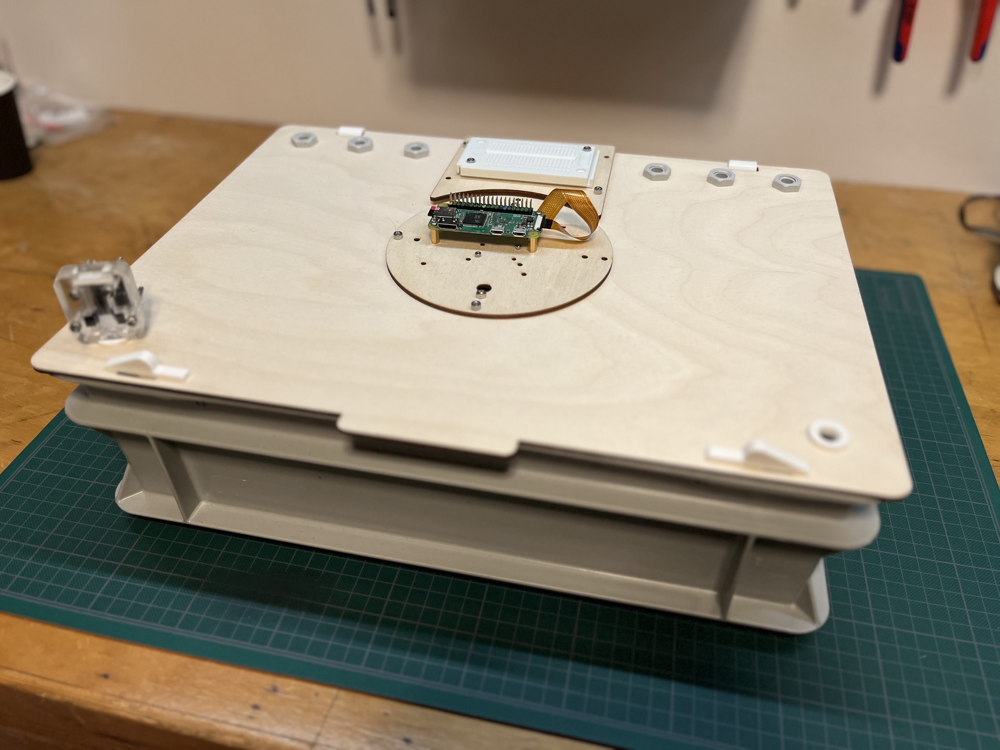

# WiggleR

The mission of **WiggleBin** is to craft an **open-source, intelligent [vermicomposting](https://en.wikipedia.org/wiki/Vermicompost) bin** that cultivates joy for both earthworms and their human stewards. 

In order to craft an open-source, intelligent composting bin, we want to understand the [Umwelt](https://en.wikipedia.org/wiki/Umwelt) (perceptual world) of worms. Hence, we've introduced the [WiggleR](./BUILD.md), our innovative open-source desktop composting research unit.

Join us in this thrilling endeavor! Embark on a captivating, modern-day Darwinian journey into the realm of worms by creating your very own [WiggleR](./BUILD.md).

## Why?

Delving into the essence of worm happiness raises intriguing queries: What defines a worm's contentment? How can we gauge their emotional state? Moreover, how do these fascinating creatures navigate and perceive their surroundings through their unique sensory mechanisms?

Unraveling these enigmas not only enhances our understanding of these small but vital ecosystem contributors but also deepens our appreciation for the interconnectedness of life on a microcosmic level.

## License

The WiggleBin is open source hardware. Hardware is covered under CERN-OHL-S-2.0 (`LICENSE.CERN-OHL-S-2.0.txt`) license and software under GPL-3.0-or-later (`LICENSE.GPL-3.0-or-later.txt`) license.

## Status

This project is in the research and testing phase. Currently our research involves trying out different sensors. See [issues](https://github.com/studiorabota/wiggle-bin/issues) for more info and how to contribute. Check [milestones](https://github.com/studiorabota/wiggle-bin/milestones) for our future plans.

## Thanks!

Many thanks to [Open Hardware Academy](https://www.openhardware.academy/01_Welcome.html) and [Stadslab Rotterdam](https://stadslabrotterdam.nl/) for making this project possible.